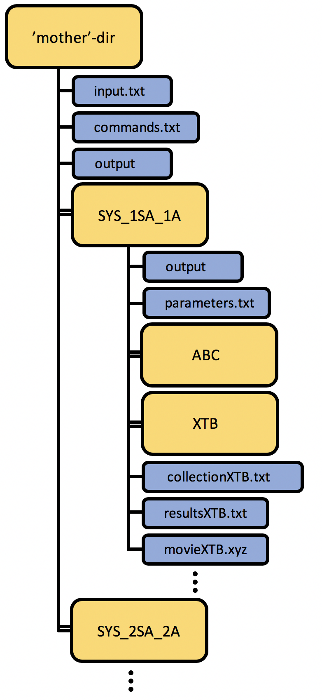

=============
JKCS1_prepare
=============

JKCS1_prepare uses the information from ``input.txt`` to create SYS_{system} subfolders in your working directory. Each SYS_{system} subfolder corresponds to a specific cluster composition. JKCS1_prepare also creates ``parameters.txt`` inside each of these subfolders. ``parameters.txt`` file is similar to ``input.txt``  and is used further for additional calculations in each subfolder. JKCS1_prepare has however added all possible combinations of conformers and conjugated acids/bases of monomers, which fulfil the composition and total charge as defined in ``input.txt``, to the end of ``parameters.txt``. User does not have to check those but these monomer combinations will be used in the configurational sampling. JKCS1_prepare does not require any arguments.

.. hint::

   For help use:
   
   .. code:: bash
   
      JKCS1_prepare -help

The folder/subfolders tree should during configurational sampling look like this: 

   
.. hint::

   Each subsequent script (e.g. JKCS2_explore or JKCS3_run) can either be called from the working directory or from one of the SYS_{system} subfolders. When called from a subfolder, it is only applied to that specific subfolder. When called from the working directory, the script is applied to all subfolders. However, you can also specify to which subfolder you want to apply scripts. See examples:
   
   .. code:: bash
   
      JKCS3_run -p XTB -m “--opt --gfn 1” SYS_2sa_*am
      JKCS4_collect XTB SYS_2sa_1am
      
   if you want to peform specific command (or sequence of commands) in each subfolder, use:
   
   .. code:: bash
   
      JKfor head -n 3 resultsXTB.dat
      JKfor "head -n 1 resultsDFT_freq.dat > ../all_results.dat"
      JKfor 'head -n 50 resultsXTB.dat > resultsXTB_FILTERED.dat; JKCS3_run -p XTB -rf XTB -nf XTB_freq -m "--hess --gfn 1"'
      
EXAMPLE: Calling JKCS1_prepare for an illustrative negatively charged cluster of 1 ammonia and 2 sulfuric acid molecules, one folder SYS_2am_1sa would be created. This folder would contain ``parameters.txt`` file where 5 possible cluster combinations are written:

• 0_1_0_0_2_0 (NH4+)1(HSO4-)2
• 0_1_0_1_0_1 (NH4+)1(cis-H2SO4)1(SO4−-)1
• 1_0_0_1_1_0 (NH3)1(cis-H2SO4)1(HSO4−)1
• 0_1_1_0_0_1 (NH4+)1(trans-H2SO4)1(SO4-−)1 
• 1_0_1_0_1_0 (NH3)1(trans-H2SO4)1(HSO4−)1

You can easily verify that these clusters all have total charge −1 and that these are all the combinations that can be made for this specific composition and total charge.
   
   
