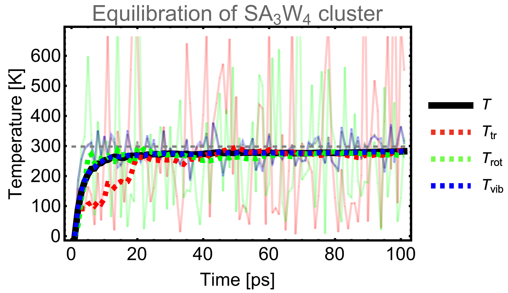

============================================
Equilibration
============================================

.. contents:: Table of Contents
   :depth: 2

Why
===

Equilibration is essential before running Molecular Dynamics (MD) simulations because it brings the system to a stable, realistic state, matching the desired temperature, pressure, and density. This step removes high-energy artifacts and prepares the system for accurate and reliable results by ensuring physically meaningful interactions and reproducibility. Skipping equilibration could lead to unphysical dynamics and inaccurate outcomes in the MD simulation.

How
===

If you run NVT simulation the goal is to equilibrate the slowest process in the system. In most cases it is the temperature but it could also be e.q. some structural behaviour of a large system if we are far from the equilibrium. We recommend using Langevin thermostat in the equilibration step as it equilibrate the vibrational, rotational, and translational temperatures faster than e.g. Nóse-Hoover or Berendsen thermosta. Otherwise, it is as simple as performing MD simulation:

.. code-block:: bash

   JKMD system.pkl -langevin 0.01 -dt 1 -ns 10000 -dump 0 -nf EQUILIBRATION -loc

This would perform equilibration on the local computer for tha last structure stored in system.pkl.
It will produce EQUILIBRATION folder with one equilibrated structures stored in the simcalc-LM.pkl. The log file from the simulation will be stored in EQUILIBRATION/calc-LM/output.

Verify
======	

If you want to be sure you have really equilibrate your system well, then it is worth monitoring the temperatuere on the way. It is quite simple just from grepping the results from the output file, where you are now interested in the T_[K] Tt[K] Tr[K] Tv[K] columns:

.. code-block:: bash

   grep JKMD: output | awk '{print $9, $10, $11, $12}' > temps.txt
   #module load gnuplot/5.4.3
   gnuplot <<< "set log x; p 'temps.txt' u 1 t 'T', '' u 2 t 'Tt', '' u 3 t 'Tr', '' u 4 t 'Tv'; pause 10"  

In the end the the mean temperature should be near the desired temperature. 

.. note::

   Langeving thermostat will not reach the exact temperature if you use QC methods.

You can save some simulation time by setting initial veloiciton of the atoms based on Maxwell-Boltzmann distribution:

.. code-block:: bash

   JKMD system.pkl -mb 300 -langevin 0.01 -dt 1 -ns 10000 -dump 0 -nf EQUILIBRATION -loc

.. note::

   As this might initiate some velicities very wrong, I prefer to use lower temperature, e.g. 200 K. This is mainly important for ML simulations as wringly started simulation can bring you to a part of PES which is not well trained with the ML.

If you want to visualize the equilibration, than you should dump the the trajectory. I think that 10-50 ps is fair enough.

.. code-block:: bash

   JKMD system.pkl -langevin 0.01 -dt 1 -ns 10000 -dump 50 -nf EQUILIBRATION -loc
   JKQC EQUILIBRATION/simcalc-LM.pkl -movie
   molden movie.xyz

Potential Issues
================

Here is a list of problems you might encounter:
- Your system explodes: Well, maybe your initial structure is far from some equilibrium or large forces are present. Try to lower the timestep at least during the equilibration.
- Your system is not equilibrated: This can easily happen for vibrational temperature of small molecules. You can try to tighten the thermostat during equilibration. In the case of large molecular systems, you might need more time to equilibrate.
- Too slow equilibration: Try to use some cheaper method for equilibration. Then the subsequent equilibration at the desired level of theory will be faster.

Follow Up Simulation
====================

You can run equilibration and the data stored will contain the positions and velocities, which you can later use for the MD simulation of your choice:

.. code-block:: bash

   JKMD system.pkl -mb 300 -langevin 0.01 -dt 1 -ns 10000 -dump 0 -nf EQUILIBRATION -loc 
   JKMD EQUILIBRATION/simcalc-LM.pkl -dt 1 -csvr 25 -dump 50 -nf MD_SIMULATION -loc
  
However, if you want to submit the job to the cluster, it make sense that you immediately run the two simulation in series. Therefore, the argument ``-folow`` allows you the start completely separate simulation. Note, that all parameters from the previous simulation are used unless redefined after the ``-folow`` argument. You can run the above like this:

.. code-block:: bash

  JKMD system.pkl -mb 300 -langevin 0.01 -dt 1 -ns 10000 -dump 0 -nf EQ+MD_SIM -follow -csvr 25 -dump 50
 
Well, another example which is rather interesting:

.. code-block:: bash

  JKMD system.pkl -mb 300 -langevin 0.01 -dt 1 -ns 10000 -dump 0 -nf EQ+EQ -follow

This would initiate the velocities and that run twice the 10k step simulation using Langevin thermostat but saving only the middle and final structures.

