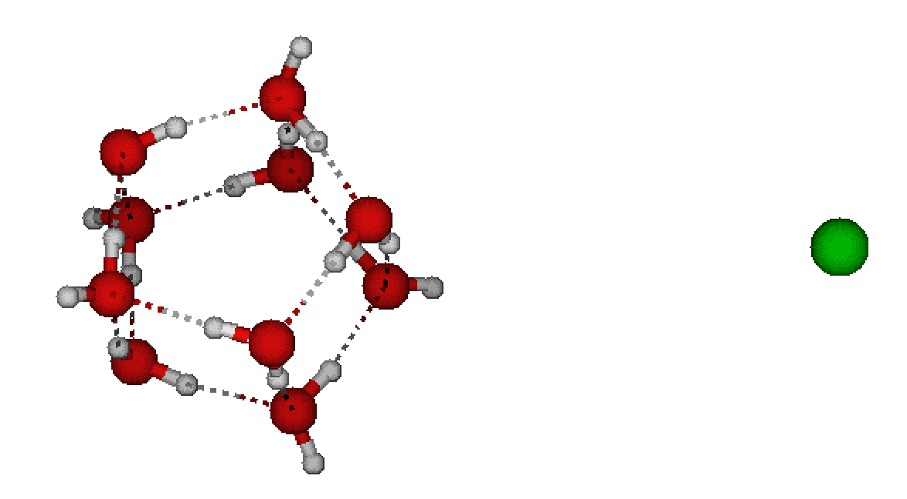

============================================
Pulling
============================================

.. contents:: Table of Contents
   :depth: 2

Introduction
============

Here, we will discuss how to pull various moulecules. As an example, I will take ``10w.xyz`` file and ``1cl.xyz`` file to construct chloride anion above water cluster:

.. code-block:: bash

   JKMD 10w.xyz -recenter 1cl.xyz -moveto [6,0,0] -ns 0 -loc

This will take quite short time, but as all the libraries has to be loaded, it can take even up tens of seconds. In the you will get this:

This is the system we will work with. 

Pulling a molecule
==================

If you wnat to pull the chloride, it is quite easy because it is a separate molecule. Let us pull it towards the cluster:

.. code-block:: bash

   JKMD 10w.xyz -recenter 1cl.xyz -moveto [6,0,0] -EF_c_COM [-1,0,0] -ns 1000 -loc

The force applied on the COM = center of mass is 1 eV/Angstrom in the direction of the cluster.

