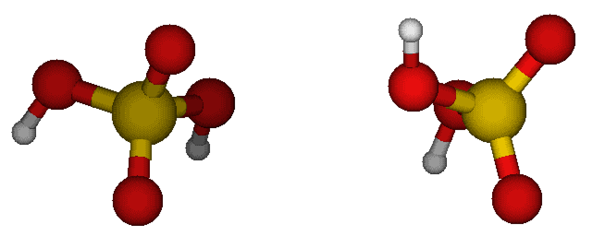
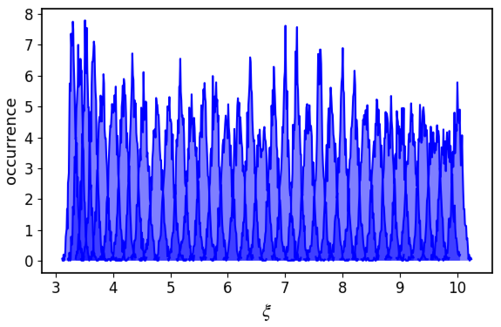
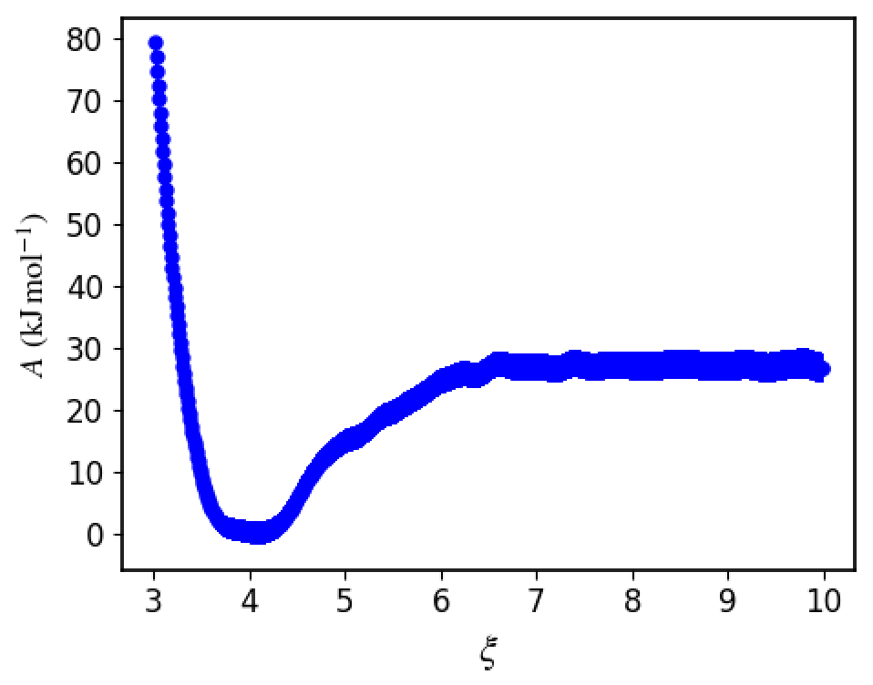

============================================
UmbrellaSampling
============================================

.. contents:: Table of Contents
   :depth: 2

About
=====

Umbrella sampling is an advanced technique in Molecular Dynamics (MD) and Monte Carlo simulations used to calculate free energy profiles along a chosen reaction coordinate, especially in systems with high energy barriers. It overcomes sampling limitations by applying biasing potentials to different windows or regions along the reaction coordinate, allowing each window to sample effectively in that region.

Each biased simulation (or "window") focuses on a specific part of the reaction coordinate, enabling the system to explore otherwise hard-to-reach configurations. Once data from all windows is collected, the biases are removed using reweighting techniques like the Weighted Histogram Analysis Method (WHAM). This yields an unbiased, continuous free energy profile, allowing for the study of rare events or transitions that standard MD simulations might not sample within feasible time scales.

In essence, umbrella sampling makes it possible to compute free energy landscapes and transition states by breaking down complex sampling tasks into manageable regions.

For more details find some literature on your own.

Preparing your system
=====================

For this example, I will use two sulfuric acid molecules and try to get their free energy profile. I believe it is fair if you equilibrate the sulfuric acid (sa) molecules first:

.. code-block:: bash

   JKMD 1sa.xyz -nf EQ_1sa -recenter -mb 300 -setvel 0 -langevin 0.01 -ns 10000 -dump 100 -par qany 

Now we are ready for the contrained simulations

Constrained simulations
=======================

Now we will put the 2 molecules together and run MD at different distances from each other.

Let us first perform MD, where we place molecules in certain distance from each other, assing the harmonic potential to keep them in such a distance, perform equilibration, and run the representative MD simulation:

.. code-block:: bash

   JKMD EQ_1sa/simcalc-LM.pkl -recenter -index -10 EQ_1sa/simcalc-LM.pkl -moveto [3.0--0.2--10,0,0] -harm 3.0--0.2--10 -langevin 0.01 -xtb GFN1-xTB -ns 100000 -dump 250 -follow -csvr 25 -ns 100000 -dump 250 -nf SA_SA_Langevin_CSVR -par q64,q48 -repeat 5

See that I am looping over the same numbers of harmonic potentials for the COM distance and the position of second molecule. Altough the molecules are equilibrated, they are not yet equilibrated in the presence of the external potential. Hence the equilibration where Langevin is used. For the real run, we recommend using canonical velocity rescaling (CSVR) thermostat as it does not have unphysical effect on the vibrations.

.. hint::
 
   Storing structures durin equilibration is not as important. Storing structures during the actual run is important and perhaps is would be good to store not that well correlated structures, i.e. storing only every e.g. 50 ps. It is easy to generate massive amount of memory-heavy data here, so be careful. 

.. note::

   In the case, you have a cluster and a you place a molecules to some distance, there would be problems if the two overlap, so you can use the :guilabel:`-moveto2` option to set some offset base on the cluster size. Like this they will not initially overlap and the molecule should get there during equilibration. See:

  .. code-block:: bash

     JKMD cluster.pkl -recenter molecules.pkl -moveto2 5.0 [0--0.2--10,0,0] ......

.. note::

   For large molecules and ionic systems you will need to scan more than 10 Angstroms.

Analyzing the trajectory
========================

.. note::

   It is good to observe some features from the simulations and be sure that e.g. no evaporation occured nor something weird happened. For instance, check the max distance between atoms in each molecules. Those are store in the pickle file under the `(log,maxA_distance)` and `(log,maxB_distance)` columns. 

For analysing the trajectory, use the :guilabel:`JKumbrellaintegration` command. You have to first enter to the SA_SA_Langevin_CSVR directory and run with suitable arguments:

.. code-block:: bash

   cd SA_SA_Langevin_CSVR
   JKumbrellaintegration -skip 100000 -symm
   
The :guilabel:`-symm` argument is used as we have two same molecules (factor of two in some equations) and :guilabel:`-skip` is used to skip the equilibration part of the trajectory. This will run for a bit but as it uses just 1 CPU, it can be performed on local computer. You can however submit it to the cluster if you used many repeats or used a long simulation:

.. code-block:: bash

   sbatch -p qany --time 20:00 JKsend JKumbrellaintegration -skip 100000 -symm

Basically what happens is that first the histogram of COM distances is plotted along the evaporation coordinate

.. note::

   Make sure the histograms from each window are partially overlapping with each other.

Then WHAM is used to obtain the free energy profile

That one is further integrated over to give you the free energy binding of the SA-SA system. It is the last number in the `umbrella_integration/output` file. In this case we got -4.01 kcal/mol. As you can see the free energy depth is not exactly the same as the binding free energy!

.. note::

   Make sure that the plotdG.png converges to a constant, otherwise there is something wrong with the simulation.
