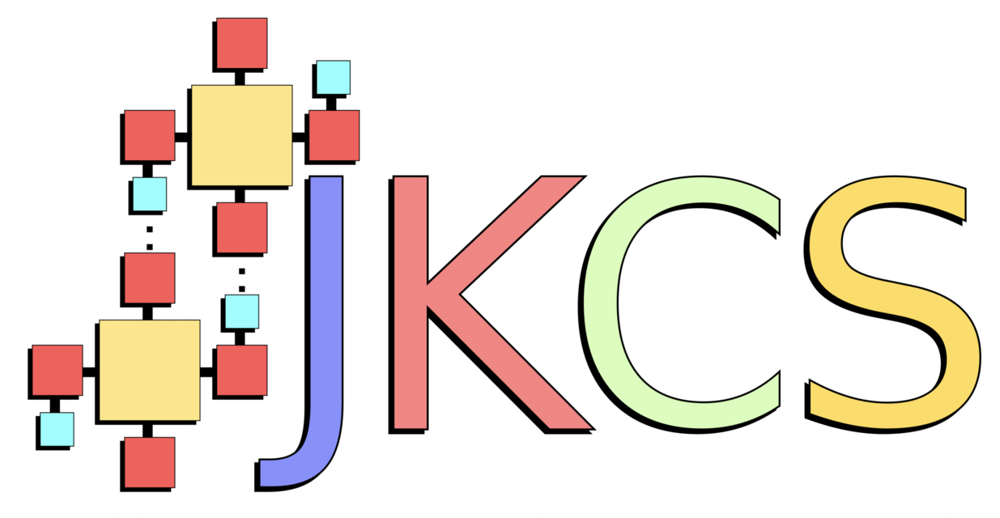

      
==============================
Welcome to JKCS documentation!
==============================

This is the online documentation for JKCS = Jammy Key for Configurational Sampling.

⚙️ `JKCS <https://github.com/kubeckaj/JKCS2.1/>`_
    The JKCS program can be on GitHub. Installation of JKCS enables JKQC and JKML, too.

📚 `Installation <https://jkcs.readthedocs.io/en/latest/JKCSSetupAndInstallation.html>`_
    Click here to see the installation tutorial.

📍 `Citation <https://pubs.acs.org/doi/full/10.1021/acs.jpca.9b03853>`_
    I would appritiate if citing my paper. Nevertheless, you must cite all papers for the methos and applications you use on the way toward studing molecular cluster.

⁉️ Questions / comments
    If you have questions, feel free to contact me: ja-kub-ecka@chem.au.dk
    
📜 Thanks
    I would like to thank all people who helped me to develope, improve, and debug the JKCS/JKQC/JKML program: Vitus Besel, Ivo Neefjes, Yosef Knattrup, and others
    
Manual structure
----------------

.. toctree::
   :maxdepth: 3
   :caption: GET STARTED
   
   JKCSSetupAndInstallation
   Citation
   ClusterSubmission

.. toctree::
   :maxdepth: 3
   :caption: JKCS
   
   BasicExample
   Inputfile
   JKCS0_copy
   JKCS1_prepare
   JKCS2_explore
   JKCS3_run
   JKCS4_collect
   JKCS5_filter
   
.. toctree::
   :maxdepth: 3
   :caption: JKQC
   
   JKQCSetupAndInstallation
   DatabaseManipulation
   
.. toctree::
   :maxdepth: 3
   :caption: JKML
   
   JKML
   
