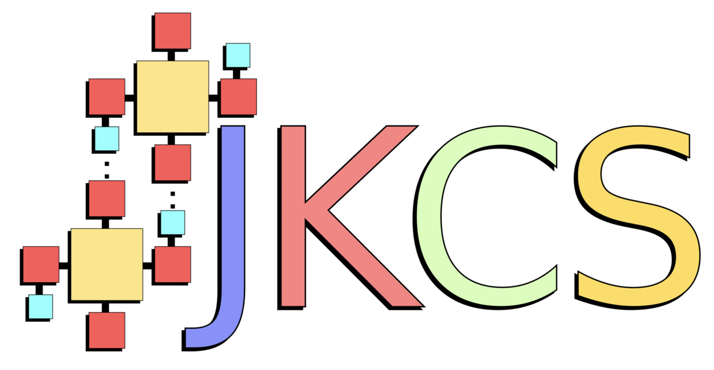

      
==============================
Welcome to JKCS documentation!
==============================

This is the online documentation for JKCS = Jammy Key for Configurational Sampling.

⚙️ `JKCS <https://github.com/kubeckaj/JKCS2.1/>`_
    The JKCS program can be on GitHub. The installation of JKCS also enables JKQC and JKML.

📚 `Installation <https://jkcs.readthedocs.io/en/latest/JKCSSetupAndInstallation.html>`_
    Click here to see the installation tutorial.

📍 `Citation <https://pubs.acs.org/doi/full/10.1021/acs.jpca.9b03853>`_
    I would appreciate if you could cite our paper (see link). Nevertheless, you must cite all papers on the methods and applications you use to study your molecular clusters. (See section Citations.)

⁉️ Questions / comments
    If you have questions, feel free to contact me: ja-kub-ecka@chem.au.dk
    
📜 Thanks
    I would like to thank all the people who helped me to develop, improve, and debug the JKCS/JKQC/JKML program: Vitus Besel, Ivo Neefjes, Yosef Knattrup, and others ❤️
    
    Thanks also go to the newest contributors: Daniel Ayioubi (for JKTS), Haide Wu (for JKout2xyz), Jakko Kahara (for constrained sampling in JKCS2_explore)
    
Manual structure
----------------

.. toctree::
   :maxdepth: 3
   :caption: GENERAL
   
   JK/JKCSSetupAndInstallation
   JK/Citation
   JK/ClusterSubmission

.. toctree::
   :maxdepth: 3
   :caption: JKCS
   
   JKCS/BasicExample
   JKCS/Inputfile
   JKCS/JKCS0_copy
   JKCS/JKCS1_prepare
   JKCS/JKCS2_explore
   JKCS/JKCS3_run
   JKCS/JKCS4_collect
   JKCS/JKCS5_filter
   
.. toctree::
   :maxdepth: 3
   :caption: JKQC
   
   JKQC/JKQCSetupAndInstallation
   JKQC/DatabaseManipulation
   
.. toctree::
   :maxdepth: 3
   :caption: JKML

   JKML/HowToQML
   JKML/HowToSchNetPack

.. toctree::
   :maxdepth: 3
   :caption: JKMD
   
   JKMD/HowToJKMD
   JKMD/Equilibration
   JKMD/UmbrellaSampling

.. toctree::
   :maxdepth: 3
   :caption: JKTS

   JKTS/JKTS

   
